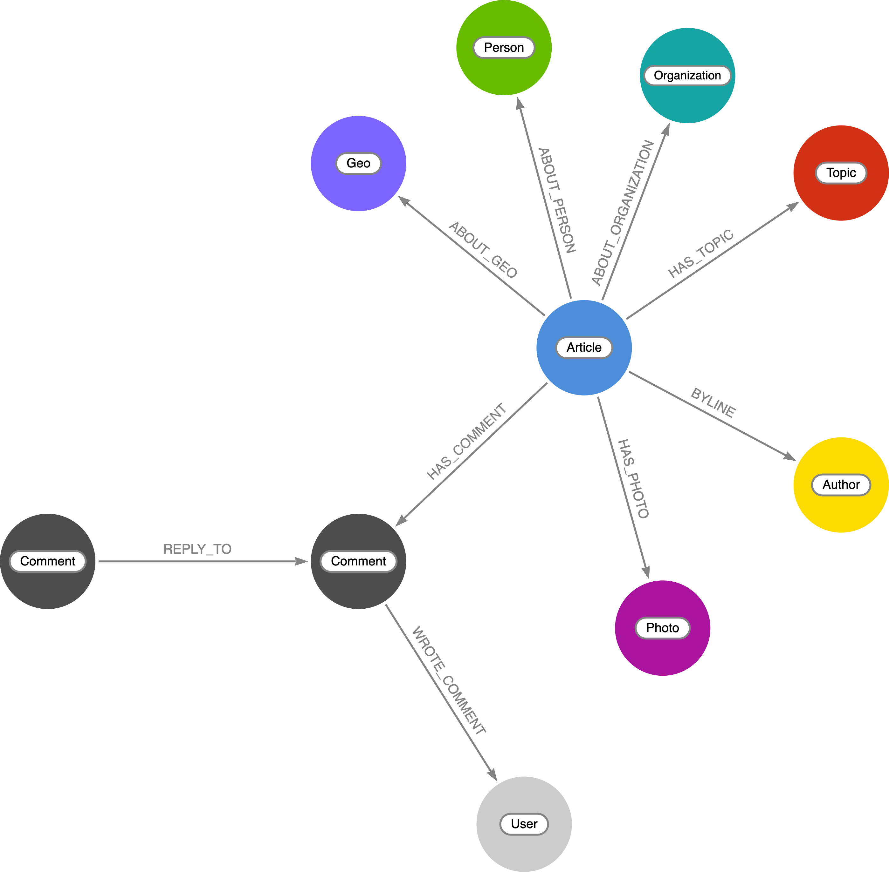

# news-graph

Working with New York Times article data in Neo4j and GraphQL.



## The Data

Data comes from the [New York Times API](https://developer.nytimes.com/). You'll need to [register for an API key](https://developer.nytimes.com/get-started), then, for example, to import the most popular articles of the last 7 days into Neo4j run this Cypher query:

```cypher
WITH "<YOUR_NYT_API_KEY_HERE>" AS key
CALL apoc.load.json("https://api.nytimes.com/svc/mostpopular/v2/viewed/7.json?api-key=" + key) YIELD value
UNWIND value.results AS article
  MERGE (a:Article {url: article.url})
    SET a.title     = article.title,
        a.abstract  = article.abstract,
        a.published = datetime(article.published_date),
        a.byline    = article.byline

  FOREACH (desc IN article.des_facet | 
    MERGE (d:Topic {name: desc})
    MERGE (a)-[:HAS_TOPIC]->(d)
  )

  FOREACH (per IN article.per_facet |
    MERGE (p:Person {name: per})
    MERGE (a)-[:ABOUT_PERSON]->(p)
  )

  FOREACH (org IN article.org_facet |
    MERGE (o:Organization {name: org})
    MERGE (a)-[:ABOUT_ORGANIZATION]->(o)
  )

  FOREACH (geo IN article.geo_facet |
    MERGE (g:Geo {name: geo})
    MERGE (a)-[:ABOUT_GEO]->(g)
  )

  MERGE (p:Photo {url: coalesce(article.media[0]["media-metadata"][2].url, "NA")})
    SET p.caption = article.media[0].caption
  MERGE (a)-[:HAS_PHOTO]->(p)

  WITH a, split(replace(substring(article.byline, 3), " and ", ","), ",") AS authors
  UNWIND authors AS author
    MERGE (auth:Author {name: trim(author)})
    MERGE (a)-[:BYLINE]->(auth)
```

Then, to add latitude, longitude for each geographic area using the `apoc.spatial.geocodeOnce` procedure:

```cypher
MATCH (g:Geo)
CALL apoc.spatial.geocodeOnce(g.name) YIELD location
SET g.location = point({latitude: location.latitude, longitude: location.longitude})
```

## GraphQL

See the [/graphql](/graphql) directory for the GraphQL API code.

## Cloudflare Workers

See the [/workers](/workers) directory for location-aware news recommendations using Cloudflare Workers and Neo4j, deployed at `https://workers.graphstuff.workers.dev/`.

* **[Improving News Recommendations With Knowledge Graphs & Cloudflare Workers](https://dev.neo4j.com/news-graph)** - presented at Cloudflare's Full Stack Week, Nov 2021 ([Video](https://dev.neo4j.com/3osz6TW), [Slides](https://dev.neo4j.com/news-graph))
